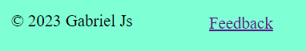

#  RHODES RESTAURANT

(Developer: Gabriel SP)

[Live webpage](https://gavriil1.github.io/arcadegame/index.html)

##  Table of Content

1. [Project Goals](#project-goals)

    1. [User Goals](#user-goals)

    2. [Site Owner Goals](#site-owner-goals)

2. [User Experience](#user-experience)

    1. [Target Audience](#target-audience)

    2. [User Requrements and Expectations](#user-requrements-and-expectations)

    3. [User Stories](#user-stories)

3. [Design](#design)

    1. [Design Choices](#design-choices)

    2. [Colour](#colours)

    3. [Fonts](#fonts)

    4. [Structure](#structure)

    5. [Wireframes](#wireframes)

4. [Technologies Used](#technologies-used)

    1. [Languages](#languages)

    2. [Frameworks & Tools](#frameworks-&-tools)

5. [Features](#features)

6. [Testing](#validation)

    1. [HTML Validation](#HTML-validation)

    2. [CSS Validation](#CSS-validation)

    3. [Accessibility](#accessibility)

    4. [Performance](#performance)

    5. [Device testing](#performing-tests-on-various-devices)

    6. [Browser compatibility](#browser-compatability)

    7. [Testing user stories](#testing-user-stories)

7. [Bugs](#Bugs)

8. [Deployment](#deployment)

    1. [Media](#media)
    2. [Code](#code)

9. [Credits](#credits)

##  Project Goals

###  User Goals

-   To relax after stresfull day by playing the game.

-   To challenage themselves and have fun.

-   Do something interesting on their free time

###  Site Owner Goals

-   Create high quality game to atract new customers/players

-   Create simple navigation around website to create great user experience

-   Create a game which can be played on all devices: computer, phone.

##  User Experience

###  Target Audience

- Main target audience is kids and teenagers age 8-23 years old.

###  User Stories

1. The user needs to understand the rules of the game quickly.
2. The user needs to have a choice to play the game with a keyboard or a mouse.
3. The user needs to have access to the game on both desktop and mobile devices.
4. The user needs to have an option to leave feedback to help the developer improve the game.
5. The user needs to find the review form easily.
6. The user needs to be sure that their feedback has been sent.
7. The user needs to find the game easily on the web page.

####  Site Owner

8. The owner needs to create an easy and intuitive web interface for the website.
9. A 404 page should be created to help users navigate to the home page in case they entered the wrong URL.
10. A contact form should be added to the website for users to send feedback.
11. The owner would like to show that their work is copyright protected.
12. An interface should be provided to help users understand the rules of the game quickly.

##  Design

###  Design Choices

-   Since the game is related to war, I selected red colors for Spartan Warior, Archer and arrow. 

- Selected black color for canvas because it is also heavy color related to war.

-   I selected calm backround colour outside of canvas, to balance red and black colour of a game.

###  Fonts

During the design development, I used the the following font-family: Times New Roman

###  Structure

<!--here is the last stop.-->

The page is built to be intuitive to the user, when it comes to game controls and page navgiation. When the user loads the main page,  he sees a tutorial in canvas window on how to play the game by using keyboard. He also can see three buttons wich helps him to play a game with mouse or on a mobile device like phone or tablet. Finally we added Feedback option in the footer, which helps user to find easily find option.

The website has 3 pages:

-   A homepage containing a game.

-   Feedback page. This page has a form for a user to leave a feedback.

-  404 page, which helps user to navigate back to home page, in the case he entered the wrong url.

###  Wireframes

Home

Feedback

404 Page

##  Technologies Used

###  Languages

- HTML

- CSS

- JavaScript

###  Frameworks & Tools

- Git

- GitHub

- Gitpod

- Visual Studio Code

- Balsamiq

- HTML Canvas

##  Features

The website comprises three pages and number of  functionalities.

###  Page Header

- On each page the header text is different. It help user to unnderstand the meanning of the page

- The hyperlink for the current page the user is viewing is emphasized.

User stories: 7. The owner needs to create easy and ituitive interface to help user to understand quickly the rules of the game.

###  Footer
<!-- the last save -->
Displayed on each page. It slightly differs on each page.
- On main page and 404 page the footer has link to feedback page.
- On feedback page the footer has link to homepage.

On each page it has copyright message.

User story: 5. User needs to find review form easily

###  Home Page

- Home page, have a game itself. Which give an easy access to the game and buttons of a game control. The gave has Feedback option in the footer

User stories: 5, 7, 8

###  Game in HTML canvas.

Game is located on Home Page, making it easily accessible for the user.

User Stories: 7

###  Game play Manual

In the center of the canvas, we have game manual which explains to the user
how to play a game.

User Stories: 1, 8

###  Winning message
When user wins the game, he sees a mesage which explains how to restart the game:

User Stories: 
1, 9

###  Game control buttons

On home page we have three buttons. This buttons allow the user to play the game on computers or mobile devices

User Stories: 2, 3

###  Feedback Page

Contact page has two section

a) Feedback Form.

b) Footer option with link to a homepage, where the game is located.

c) ALert window, which show up when a user click "Sent" option of the form

User stories: 
4, 5, 6, 7, 8, 10, 11

###  Feedback Form

Feedback form allows user to send feedback to the site owner.

User stories: 
4, 5 ,12

###  Footer option with link to a homepage, where the game is located.

Allows a user to return back to a home page, making navigation easy

User stories: 8

###  ALert window, which show up when a user click "Sent" option of the form

Alert window informs user that his feedback was sent.

User stories: 6

###  404 Page

 404 page should be created, to help user to navigate to home page in case wrong urls was entered.

Since the website is small, we added to it initial game, and added a link to Feedback option.

User story: 9.

##  Validation

###  HTML Validation

We utilized the W3C Markup Validation Service to validate the HTML of our website. The Home and 404 pages passed validation with no errors. However, the
feedback page shows a warning. Since this line of code  is taken from EmailJs API for a form to work, I leave everything as it is

Home

Feedback

404-Page

###  CSS Validation

The CSS of the website was validated using the W3C Jigsaw CSS Validation Service, which yielded no errors.

whole page

CSS Home page validation: No Errors

style.css

Upon examination, no CSS errors were detected in the CSS.style document.

###  Accessibility

To ensure the website met high accessibility standards, the WAVE WebAIM web accessibility evaluation tool was utilized.

Home

On this page, we have identified 0 errors and 1 alert. 

Feedback

On this page, we have identified 0 errors and 1 alert. 

404 Page

TOn this page, we have identified 0 errors and 3 alert. 

###  Performance

The performance of the website was tested using Google Lighthouse.
The site received high score for Performance, Accessibility and Best Practices

Home

Screenshot of Desktop performance of Home page in Google Lighthouse.

Screenshot of Mobile performance of Home page in Google Lighthouse.

Feedback

Screenshot of Desktop performance of Contact page in Google Lighthouse.

Screenshot of Mobile performance of Contact page in Google Lighthouse.

404 Page

Screenshot of Desktop performance of 404 page in Google Lighthouse.

Screenshot of Mobile performance of 404 page in Google Lighthouse.

###  Performing tests on various devices

Testing of the website was conducted on the following devices:

- Latitude 5520

- Redmi Note 10

- Samsung Tablet A10.1

Furthermore, the website underwent testing using the Device Toggling feature of Google Chrome Developer Tools, which includes all available device options.

###  Browser compatability

The following browsers were used to test the website:

- Google Chrome

- Mozilla Firefox

- Microsoft Egde

###  Testing user stories

1. The user needs to understand the rules of the game quickly.

| **Feature** | **Action** | **Expected Result** | **Actual Result** |
|-------------|------------|---------------------|-------------------|
| HTML Canvas | Navigate to Home Page and find game instructions in the black box | See game instructions | Works as expected |
| Game Control buttons | Navigate to contact page, find buttons, see text of them. | Finding "Left", "Right", File"  | Works as expected |

Screenshots

2. The user needs to have a choice to play the game with a keyboard or a mouse.

| **Feature** | **Action** | **Expected Result** | **Actual Result** |
|-------------|------------|---------------------|-------------------|
| Game Control buttons | Navigate to homepage | Find buttons, which you can use on mobile phone, or on desktop with mouse | Works as expected |
|  Game in Html Canvas | Navigate to home page| Verify that the archer moves while pressing "a", "s", "d" | Works as expected |

Screenshots

3. The user needs to have access to the game on both desktop and mobile devices.

<!--- I stopped here --->

| **Feature** | **Action** | **Expected Result** | **Actual Result** |
|-------------|------------|---------------------|-------------------|
| Responsive design | Open Game in the desktop and mobile phone | Verify that a game and game controls gan be seen on both devices | Works as expected |

Screenshots

4. The user needs to have an option to leave feedback to help the developer improve the game.

| **Feature** | **Action** | **Expected Result** | **Actual Result** |
|-------------|------------|---------------------|-------------------|
| Footer | Click on "Feedback" | User in redirected to Feedback page | Works as expected |
| Feedback Form | Write a feedback, click "send" | User's feedback is sent to the game developer | Works as expected |

Screenshots

5. I want to be informed about the opening hours as a returning user.

| **Feature** | **Action** | **Expected Result** | **Actual Result** |
|-------------|------------|---------------------|-------------------|
| Info Box| Contact page -> Infor Box -> Opening hours  | See opening hours | Works as expected |

Screenshots

6. As a returning user, I want to find a phone number to call for reservation

| **Feature** | **Action** | **Expected Result** | **Actual Result** |
|-------------|------------|---------------------|-------------------|
| Info Box | Contact Page -> Info Box-> Search for Phone number | See phone number | Works as expected |

Screenshots

7. As a returning user, I want to see the menu

| **Feature** | **Action** | **Expected Result** | **Actual Result** |
|-------------|------------|---------------------|-------------------|
| Menu | Navigate to the menu page | Read the menu | Works as expected |

Screenshots

8. I want to provide feedback, suggestions, or a message to the restaurant's staff as a returning user.

| **Feature** | **Action** | **Expected Result** | **Actual Result** |
|-------------|------------|---------------------|-------------------|
| Contact Form | Please go to the Contact Us Page and find the contact form. Complete the form with your information and send it.| Data submited via contact form | Works as expectd |

Screenshots

9. I want to find the restaurant on social media .

| **Feature** | **Action** | **Expected Result** | **Actual Result** |
|-------------|------------|---------------------|-------------------|
| Footer  | On any page scroll to the bottom | Click on social media links | Works as expected |

Screenshots

10. As a returning user, I want to get directions to the restaurant

| **Feature** | **Action** | **Expected Result** | **Actual Result** |
|-------------|------------|---------------------|-------------------|
| Map | Contact Page -> Google Map ->  click on directions link | View the restaurant's directions on Google Maps.| Works as expected |

Screenshots

11. As the site owner, I want users to access the site and learn more about the restaurant nt

| **Feature** | **Action** | **Expected Result** | **Actual Result** |
|-------------|------------|---------------------|-------------------|
| Home Page| Navigate to Home Page | View the restaurant's panorama and read its description. | Works as expected |

Screenshots

12. As the site owner, I want users to find our contact details to contact us .

| **Feature** | **Action** | **Expected Result** | **Actual Result** |
|-------------|------------|---------------------|-------------------|
| Contact Form | Contact Page -> Contact Form -> Enter text -> Submit | Data submited via contact form | Works as expectd |
| Info Box | Contact page -> Infor Box -> Find Phone and Email | Find the phone number, Email  | Works as expected |

Screenshots

13. As the site owner, I want users to be redirected to the 404 page so that they can navigate back to the pages shown in the navigation bar

| **Feature** | **Action** | **Expected Result** | **Actual Result** |
|-------------|------------|---------------------|-------------------|
| 404 Page | user Enters wrong URL | User sees 404 page. On it he sees navigation bar on website and select the page he needs. | Works as expectd |

Screenshots

## Bugs

| **Bug** | **Fix** |
| ----------- | ----------- |
| Up/Down buttoms did not work | Fixed it by changing onClick to onmousedown|
| After going to inspect bottoms stopped working again | Fixed it, by adding settimeout function to unSendKey function |
|  Spartans was moving out of the screen. |  Fixed the issue by adding Canvas width condiation keycodes.a.pressed && archer.placement.x >= 0 |

##  Deployment

## Deployment
These steps were followed to deploy the website using GitHub Pages:
1. Go to the Settings tab within the GitHub repository.
2. Choose Pages from the menu located on the left hand side.
3. Under "Build and deployment", under "Source", select GitHub Actions.
4. After the webpage refreshes automaticaly you will see text: "Your site is live at https://gavriil1.github.io/arcadegame/"

    Please check the following link for more information: https://docs.github.com/en/pages/getting-started-with-github-pages/configuring-a-publishing-source-for-your-github-pages-site

Follow these steps to fork the repository:
1. Visit the GitHub repository.
2. Click on "Fork button" in upper right hand corner

    Please check the following link for more information: https://docs.github.com/en/get-started/quickstart/fork-a-repo

Follow these steps to clone the repository:
1. Go to the GitHub repository 
2. Find the "Code" button located above the file list and click on it.
3. Choose whether you prefer to clone via HTTPS, SSH, or Github CLI, and then click on the copy button to copy the URL to your clipboard.
4. Open Git Bash
5. Navigate to the directory where you would like to clone the directory and set it as the current working directory.
6. Type git clone and paste the URL from the clipboard ($ git clone https://github.com/YOUR-USERNAME/YOUR-REPOSITORY)
7. Hit the Enter key to create your local clone.

    Please check the following link for more information: https://docs.github.com/en/repositories/creating-and-managing-repositories/cloning-a-repository

## Credits

###  Media

I have two images: 
1. ancient-greek-spartan-warrior-6839912.png
2. cartoon-martial-arts-character-archery_4042629.png

Both of them are downloaded from https://id.pngtree.com/

###  Code

In order of apearance:

- Spartan Invader: [Udemy Course](https://www.udemy.com/course/space-invaders-with-javascript-and-html-canvas/)
- Contact/Feedback Form: [w3schools](https://www.w3schools.com/howto/howto_css_contact_form.asp) 
- API and JS function Sending Email from Contatct Form: [EmailJs](https://www.emailjs.com/docs/tutorial/creating-contact-form/)
