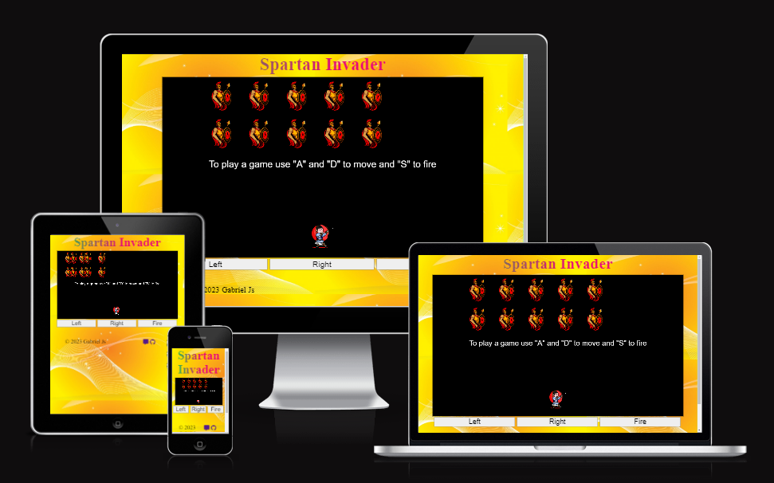
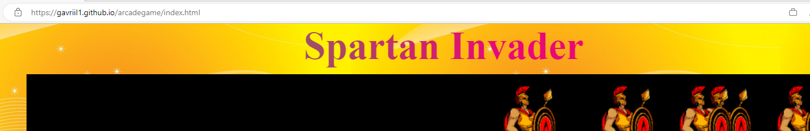
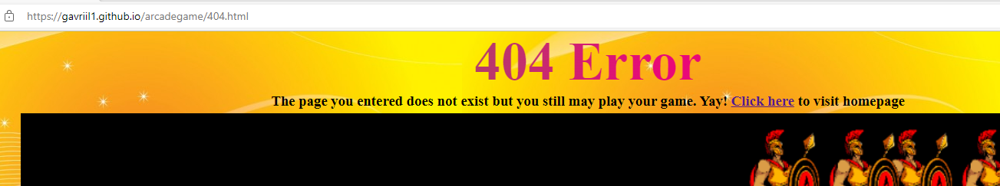
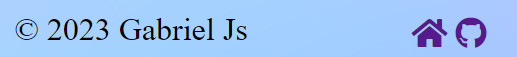
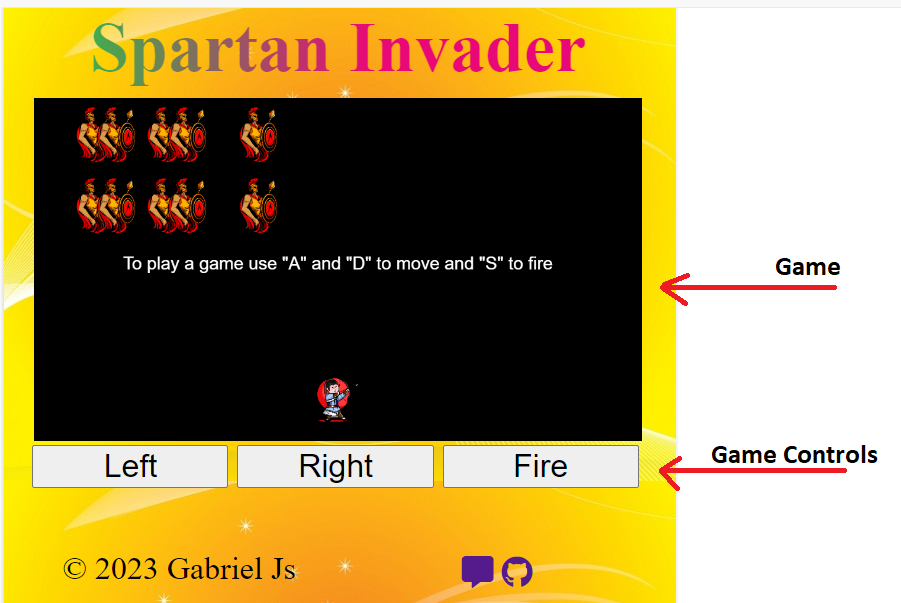
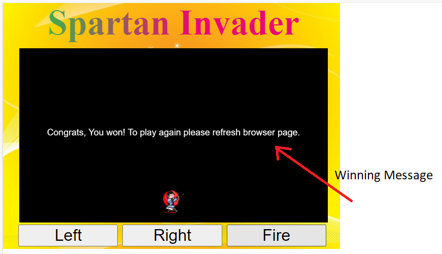
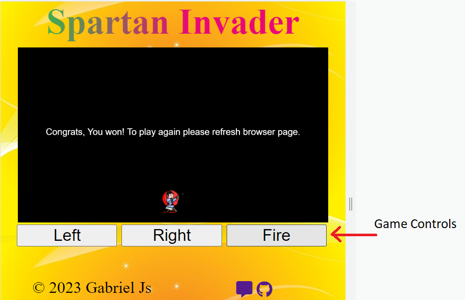

#  Spartan Invader

(Developer: Gabriel SP)

[Live webpage](https://gavriil1.github.io/arcadegame/index.html)

##  Table of Content

1. [Project Goals](#project-goals)

    1. [Project Goals](#project-goals)

    2. [Site Owner Goals](#site-owner-goals)

2. [User Experience](#user-experience)

    1. [Target Audience](#target-audience)

    2. [User Stories](#user-stories)

    3. [Owner Stories](#owner-stories)

3. [Design](#design)

    1. [Colours](#colours)

    2. [Fonts](#fonts)

    3. [Structure](#structure)

    4. [Wireframes](#wireframes)

4. [Technologies Used](#technologies-used)

    1. [Languages](#languages)

    2. [Frameworks Tools](#frameworks-tools)

5. [Features](#features)

6. [Testing](#validation)

    1. [HTML Validation](#HTML-validation)

    2. [CSS Validation](#CSS-validation)

    3. [JS Validation](#JS-Validation)

    4. [Accessibility](#accessibility)

    5. [Performance](#performance)

    6. [Device testing](#performing-tests-on-various-devices)

    7. [Browser compatibility](#browser-compatability)

    8. [Testing user stories](#testing-user-stories)

7. [Bugs](#Bugs)

8. [Deployment](#deployment)

    1. [Media](#media)
    2. [Code](#code)

9. [Credits](#credits)

##  Project Goals

- To relax after a stressful day, one can play games.

- Doing something interesting in their free time can be a great way to unwind and enjoy themselves.

###  Site Owner Goals

-  Create a high-quality game to attract new customers/players.

- Create simple navigation around the website to provide a great user experience.

- Create a game that can be played on all devices, including computers and phones.

##  User Experience

###  Target Audience

- Our main target audience comprises kids and teenagers between the ages of 8 and 23.

###  User Stories

1. The user needs to understand the rules of the game quickly.
2. The user needs to have a choice to play the game with a keyboard or a mouse.
3. The user needs to have access to the game on both desktop and mobile devices.
4. The user needs to have an option to leave feedback to help the developer improve the game.
5. The user needs to find the review form easily.
6. The user needs to be sure that their feedback has been sent.
7. The user needs to find the game easily on the web page.

####  Owner Stories

8. A 404 page should be created to help users navigate to the home page in case they entered the wrong URL.
9. A contact form should be added to the website for users to send feedback.
10. The owner would like to show that their work is copyright protected.

##  Design

###  Colours

- To reflect the war theme of the game, I opted for red colors for the Spartan Warrior, Archer, and arrow.
- I chose black as the color for the canvas, as it is a dark color that is often associated with war.
- To balance out the dominant red and black colors used in the game, I selected a calm background color outside of the canvas.

###  Fonts

During the design development, I used the the following font-family: Times New Roman

###  Structure

The page is designed to be intuitive for the user, both in terms of game controls and page navigation. When the user loads the main page, they will see a tutorial in the canvas window explaining how to play the game using a keyboard. Additionally, there are three buttons available to allow users to play the game using a mouse or on a mobile device such as a phone or tablet. Finally, we have added a feedback option in the footer, making it easily accessible to the user.

The website consists of three pages:

A homepage containing the game.
A feedback page that includes a form for users to provide feedback.
A 404 page that helps users navigate back to the homepage in case they enter the wrong URL.

###  Wireframes

Home

Feedback

404 Page

##  Technologies Used

###  Languages

- HTML

- CSS

- JavaScript

###  Frameworks Tools

- Git

- GitHub

- Gitpod

- Visual Studio Code

- Balsamiq

- HTML Canvas

##  Features

The website has  three pages and number of  functionalities.

###  Page Header

- On each page, the header text is different, which helps the user to understand the purpose of the page.

User stories: 7. 

###  Footer

Displayed on each page, it slightly differs on each page. On the main page and 404 page, the footer has a link to the feedback page. On the feedback page, the footer has a link to the homepage. Each page also includes a copyright message.

User story: 5. 

###  Home Page

- The homepage features the game, providing easy access to game controls through buttons. The game also has a feedback option in the footer.

User stories: 5, 7, 

###  Game in HTML canvas.

The sentence is grammatically correct and there are no spelling errors.

User Stories: 7

###  Game play Manual

In the center of the canvas, we have game manual which explains to the user
how to play a game.

User Stories: 1

###  Winning message
When user wins the game, he sees a mesage which explains how to restart the game:

User Stories: 
1

###  Game control buttons

Check grammar and spelling: On the home page, we have three buttons that allow the user to play the game on computers or mobile devices.

User Stories: 2, 3

###  Feedback Page

Contact page has two section

The contact page has three sections:

a) Feedback Form.

b) Footer option with a link to the homepage where the game is located.

c) Alert window that shows up when a user clicks the "Send" option of the form.

User stories: 
4, 5, 6, 7, 9, 10

###  Feedback Form

Feedback form allows user to send feedback to the site owner.

User stories: 
4, 5 

###  Footer option with link to a homepage, where the game is located.

This allows the user to easily navigate back to the home page.

User stories: 5

###  ALert window, which show up when a user click "Sent" option of the form

The alert window informs the user that their feedback has been sent.

User stories: 6

###  ALert window, which show up when a user submit an empty form.

The alert window informs the user that their feedback has been sent.

User stories: 9

docs/testuserstories/9th-user-story.png

###  404 Page

A 404 page should be created to help the user navigate to the home page in case they entered the wrong URL.

Since the website is small, we added an initial game to it and a link to the homepage

User story: 8

##  Validation

###  HTML Validation

Check grammar and spelling: We utilized the W3C Markup Validation Service to validate the HTML of our website. The Home and 404 pages passed validation with no errors. However, the feedback page shows a warning. Since it's just a warning, I decided to leave everything as it is.

Home

Feedback

404-Page

###  CSS Validation

The CSS of the website was validated using the W3C Jigsaw CSS Validation Service, which yielded no errors.

whole page

CSS Home page validation: No Errors

style.css

Upon examination, no CSS errors were detected in the CSS.style document.

###  JS Validation

The JS of the website was validated using the https://jshint.com/ Validation Service. 

I have to js files: index.js and form.js. The script shows undefined or not used variables. All the alerts are false positive.

indxex.js

form.js

###  Accessibility

To ensure the website met high accessibility standards, the WAVE WebAIM web accessibility evaluation tool was utilized.

Home

On this page, we have identified 0 errors and 1 alert. 

Feedback

On this page, we have identified 0 errors and 1 alert. 

404 Page

On this page, we have identified 0 errors and 5 alert. 

###  Performance

The performance of the website was tested using Google Lighthouse. The site received a high score for performance, accessibility, and best practices.

Home

Screenshot of Desktop performance of Home page in Google Lighthouse.

Screenshot of Mobile performance of Home page in Google Lighthouse.

Feedback

Screenshot of Desktop performance of Contact page in Google Lighthouse.

Screenshot of Mobile performance of Contact page in Google Lighthouse.

404 Page

Screenshot of Desktop performance of 404 page in Google Lighthouse.

Screenshot of Mobile performance of 404 page in Google Lighthouse.

###  Performing tests on various devices

Testing of the website was conducted on the following devices:

- Latitude 5520

- Redmi Note 10

- Samsung Tablet A10.1

Furthermore, the website underwent testing using the Device Toggling feature of Google Chrome Developer Tools, which includes all available device options.

###  Browser compatability

The following browsers were used to test the website:

- Google Chrome

- Mozilla Firefox

- Microsoft Egde

###  Testing user stories

1. The user needs to understand the rules of the game easily.

| **Feature** | **Action** | **Expected Result** | **Actual Result** |
|-------------|------------|---------------------|-------------------|
| HTML Canvas | Navigate to the Home Page and find game instructions in the black box | See game instructions | Works as expected |
| Game Control buttons | Navigate to the contact page, find buttons, and see the text | Finding "Left", "Right", "File" | Works as expected |

Screenshots

2. The user needs to have a choice to play the game with a keyboard or a mouse.

| **Feature** | **Action** | **Expected Result** | **Actual Result** |
|-------------|------------|---------------------|-------------------|
| Game Control Buttons | Navigate to homepage | Find the buttons that can be used on mobile phones or with a mouse on a desktop | Works as expected |
| Game in HTML Canvas | Navigate to homepage | Verify that the archer moves when pressing "a", "s", or "d" | Works as expected |

Screenshots

3. The user needs to have access to the game on both desktop and mobile devices.

| **Feature** | **Action** | **Expected Result** | **Actual Result** |
|-------------|------------|---------------------|-------------------|
| Responsive design | Open Game in the desktop and mobile phone | Verify that a game and game controls gan be seen on both devices | Works as expected |

Screenshots

4. The user needs to have an option to leave feedback to help the developer improve the game.

| **Feature** | **Action** | **Expected Result** | **Actual Result** |
|-------------|------------|---------------------|-------------------|
| Footer | Click on "Feedback" | User is redirected to Feedback page | Works as expected |
| Feedback Form | Write feedback, click "send" | User's feedback is sent to the game developer | Works as expected |

Screenshots

5. The user needs to find the review form easily.

| **Feature** | **Action** | **Expected Result** | **Actual Result** |
|-------------|------------|---------------------|-------------------|
| Footer | Click on "Feedback" | User in redirected to Feedback page | Works as expected |
| Feedback Form | Write a feedback, click "send" | User's feedback is sent to the game developer | Works as expected |

Screenshots

6. The user needs to be sure that their feedback has been sent.

| **Feature** | **Action** | **Expected Result** | **Actual Result** |
|-------------|------------|---------------------|-------------------|
| Alert Window | Write Feedback, Click Send | Alert Window should show up | Works as expected |

Screenshots

7. The user needs to find the game easily on the web page.

| **Feature** | **Action** | **Expected Result** | **Actual Result** |
|-------------|------------|---------------------|-------------------|
| Game in HTML canvas | Open Home page  | Find a game on Home page | Works as expected |

Screenshots

8. A 404 page should be created to help users navigate to the home page in case they entered the wrong URL.

| **Feature** | **Action** | **Expected Result** | **Actual Result** |
|-------------|------------|---------------------|-------------------|
| 404 page| Enter wrong url. | See 404 page with a link to home page | Works as expected |

Screenshots

9. The owner would like to inform user that feedback form is empty, if user tries to submit an empty form.

| **Feature** | **Action** | **Expected Result** | **Actual Result** |
|-------------|------------|---------------------|-------------------|
| Feedback Form  | Home Page->Feedback->Feedback Form | Find Feedback form to leave a review| Works as expected |

Screenshots

10. The owner would like to show that their work is copyright protected.

| **Feature** | **Action** | **Expected Result** | **Actual Result** |
|-------------|------------|---------------------|-------------------|
| Footer | HOme Page-> Footer -> Copyright | See copyright message| Works as expected |

Screenshots

## Bugs

| **Bug** | **Fix** |
| ----------- | ----------- |
| Up/Down buttons did not work | Fixed by changing onClick to onmousedown |
| After going to inspect screen, buttons stopped working again | Fixed by adding setTimeout function to unSendKey function |
| Spartans were moving out of the screen. | Fixed the issue by adding a canvas width condition, "keycodes.a.pressed && archer.placement.x >= 0". |
| EmailJs does not send feedback of the user | Fixed the issue by changing textara name to "message". |

##  Deployment

## Deployment
These steps were followed to deploy the website using GitHub Pages:
1. Go to the Settings tab within the GitHub repository.
2. Choose Pages from the menu located on the left hand side.
3. Under "Build and deployment", under "Source", select GitHub Actions.
4. After the webpage refreshes automaticaly you will see text: "Your site is live at https://gavriil1.github.io/arcadegame/"

    Please check the following link for more information: https://docs.github.com/en/pages/getting-started-with-github-pages/configuring-a-publishing-source-for-your-github-pages-site

Follow these steps to fork the repository:
1. Visit the GitHub repository.
2. Click on "Fork button" in upper right hand corner

    Please check the following link for more information: https://docs.github.com/en/get-started/quickstart/fork-a-repo

Follow these steps to clone the repository:
1. Go to the GitHub repository 
2. Find the "Code" button located above the file list and click on it.
3. Choose whether you prefer to clone via HTTPS, SSH, or Github CLI, and then click on the copy button to copy the URL to your clipboard.
4. Open Git Bash
5. Navigate to the directory where you would like to clone the directory and set it as the current working directory.
6. Type git clone and paste the URL from the clipboard ($ git clone https://github.com/YOUR-USERNAME/YOUR-REPOSITORY)
7. Hit the Enter key to create your local clone.

    Please check the following link for more information: https://docs.github.com/en/repositories/creating-and-managing-repositories/cloning-a-repository

## Credits

###  Media

I have two images: 
1. ancient-greek-spartan-warrior-6839912.png
2. cartoon-martial-arts-character-archery_4042629.png

Both of them are downloaded from https://id.pngtree.com/

###  Code

In order of apearance:

- Spartan Invader: [Udemy Course](https://www.udemy.com/course/space-invaders-with-javascript-and-html-canvas/)
- API and JS function which sends Email from Contatct Form: [EmailJs](https://www.emailjs.com/docs/tutorial/creating-contact-form/)
