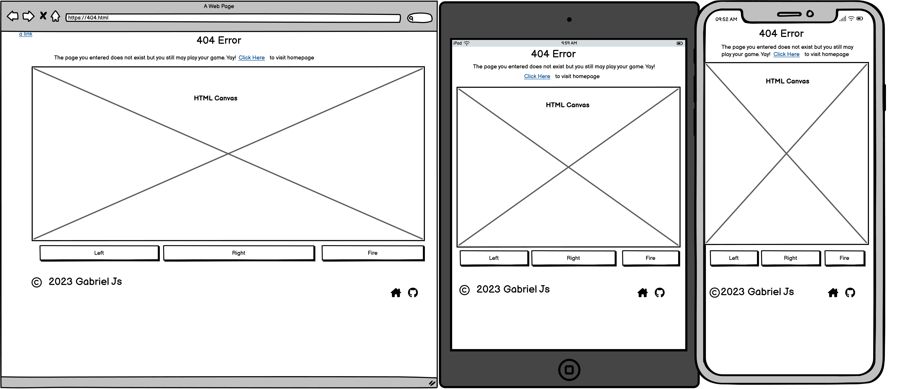

#  RHODES RESTAURANT

(Developer: Gabriel SP)

##  Table of Content

1. [Project Goals](#project-goals)

    1. [User Goals](#user-goals)

    2. [Site Owner Goals](#site-owner-goals)

2. [User Experience](#user-experience)

    1. [Target Audience](#target-audience)

    2. [User Requrements and Expectations](#user-requrements-and-expectations)

    3. [User Stories](#user-stories)

3. [Design](#design)

    1. [Design Choices](#design-choices)

    2. [Colour](#colours)

    3. [Fonts](#fonts)

    4. [Structure](#structure)

    5. [Wireframes](#wireframes)

4. [Technologies Used](#technologies-used)

    1. [Languages](#languages)

    2. [Frameworks & Tools](#frameworks-&-tools)

5. [Features](#features)

6. [Testing](#validation)

    1. [HTML Validation](#HTML-validation)

    2. [CSS Validation](#CSS-validation)

    3. [Accessibility](#accessibility)

    4. [Performance](#performance)

    5. [Device testing](#performing-tests-on-various-devices)

    6. [Browser compatibility](#browser-compatability)

    7. [Testing user stories](#testing-user-stories)

7. [Bugs](#Bugs)

8. [Deployment](#deployment)

    1. [Media](#media)
    2. [Code](#code)

9. [Credits](#credits)

##  Project Goals

###  User Goals

-   Discovering a restaurant that provides both a pleasant ambiance and delicious cuisine..

-   Accessing a comprehensive menu that displays pricing in a clear and concise manner.

-   Obtaining details about the restaurant Email, Phone, Google Map Location.

###  Site Owner Goals

-   Increase the client base.

-   Advertise the business to tourists and locals.

-   Offer a means for new and current customers to reach out to the restaurant.

##  User Experience

###  Target Audience

- Individuals who are searching for a dining venue.

- Individuals who are interested in a take-away option.

- Groups who are seeking a location to host a small event

###  User Requrements and Expectations

- A well-designed website where everything feels intuitive.

- Content that is easy to read and understand.

- Modern design and layout that works on different devices.

- Possibility to easily locate contact information of the business, such as email, phone, and Google Maps.

- Opportunity to read the menu and pricing of the restaurant.

###  User Stories

####  First-time User

1.  As a new visitor, I would like to easily find the restaurant's location.

2.  As a first-time customer, I want to know the pricing options available at the restaurant.

3.  As a first time user, I want to know more about the restaurant

4.  As a first-time visitor, I want to have an idea of what to expect during my visit to the restaurant.

####  Returning User
 
5.  I want to be informed about the opening hours as a returning user.
    
6.  As a returning user, I want to find a phone number to call for reservation
    
7.  As a returning user, I want to see the menu
    
8.  I want to provide feedback, suggestions, or a message to the restaurant's staff as a returning user.
    
9.  I want to find the restaurant on social media.
    
10.  As a returning user, I want to get directions to the restaurant.

####  Site Owner
  
11.  As the site owner, I want users to access the site and learn more about the restaurant 
    
12.  As the site owner, I want users to find our contact details to contact us .

13. As the site owner, I want users to be redirected to the 404 page so that they can navigate back to the pages shown in the navigation bar

##  Design

###  Design Choices

-   Since Tavern is located on a sea coast, I added a lot of blue to the website.

-   I tried to show how easy, calm, and relaxed the experience at Rhodes Restaurant is.

-   I made the page simple for the user, so the user could take action by contacting the restaurant to book a table.

###  Fonts

During the design development, I used the following list of fonts: Lato, Oswald, sans-serif, Arial.

 

-   I use Lato as the default font for the **body** on all pages.

-   Oswald is used for the logo.

-   Arial font was used for **h2**, **p**, and **body** of the booking page.

-    Sans-serif is used as a backup.

###  Structure

The page is organized in a way that is familiar to the end user. When a user opens a landing page, they can see a classical navigation bar with the logo on the left-hand side and the navigation links on the right-hand side.

The website is composed of four distinct pages:

-   A homepage containing a description of the restaurant and showcasing its beautiful surroundings.

-   A menu page.

-   A gallery page displaying images that capture the overall atmosphere of the restaurant.

-   A contact page that includes a Google Map, contact details of the restaurant, and a contact form.

###  Wireframes

Home

Menu

Gallery

Contact

404 Page

##  Technologies Used

###  Languages

- HTML

- CSS

###  Frameworks & Tools

- Git

- GitHub

- Gitpod

- convert (Linux Bash script)

- Balsamiq

- Google Fonts

- Font Awsome 

##  Features
<!-- the last save -->
The website comprises four pages and <NUMBER> functionalities.

###  Logo and Navigation Bar

- Displayed on each of the five pages.

- The navigation bar is completely adaptable and transforms into a hamburger menu on smaller displays.

- The hyperlink for the current page the user is viewing is emphasized.

###  Footer

- Displayed on each of the five pages.

- Consists of four icons: Facebook, Twitter, YouTube, Instagram. Each icon is linked to a hyperlink.

User story: 9

<!-- the last save -->

###  Home Page

- Gives a description of the restaurant with a image of the dining area next to the sea. 

User stories: 3, 11

###  Menu

- The menu is divided into three sections: Starters, Main Courses, and Desserts.

- Each showcasing a picture of one of the items on offer. 

- Additionally, the menu includes pricing information for each item.

User stories: 2, 7

###  Image Gallery

- Gallery section shows dishes, great view of the restaurant and user experience.

- The pictures of the restaurant are presented in a grid layout.

User Stories: 4

###  Contact Page

Contact page has three section:

a) Info Box.

b) Google Map.

c) Contact Form.

User stories: 1, 5, 6, 8, 10, 12

###  Info Box

The user is furnished with details about the restaurant such as its address, phone number, email, and the name of its proprietor.

User stories: 5, 6, 12

###  Contact Form

A way for users to send an email to a restaurant to book a table or leave feedback.

User stories: 8, 12

###  Map

Displays the restaurant's location using an embedded Google Map.

User stories: 1, 10

###  404 Page

This page helps the user navigate to the home, menu, gallery, and contact pages when the user mistakenly enters the wrong URL.

User story: 13

##  Validation

###  HTML Validation

We utilized the W3C Markup Validation Service to validate the HTML of our website. The Home and Menu pages passed without errors; however, the Gallery and Contact pages returned warnings and errors. Based on my assessment, I deem these errors to be false positives. I have added comments to each section to provide justification for my conclusion.

Home

Menu

Gallery

An error was detected on the 'Gallery' page, which has been attributed to the methodology utilized by the lecturer in the CodeInstitute example. Despite the warning, we have opted to retain the existing structure, and therefore, we will not convert the section to a div

Contact

Two errors have been identified on this page; however, after thorough investigation, we believe that both are false positives. It is not feasible to modify the '100%' value to '100' as it would cause page breakage. Additionally, the use of 'px' in height is an acceptable CSS method, as outlined by the W3C CSS specification (https://developer.mozilla.org/en-US/docs/Web/CSS/height). Consequently, we have made a decision to disregard these errors and consider them as false positives.

404-Page

###  CSS Validation

The CSS of the website was validated using the W3C Jigsaw CSS Validation Service, which yielded no errors.

whole page

CSS Home page validation: No Errors

CSS Menu page validation: No Errors

CSS Gallery page validation: No Errors

CSS Contact page validation: No Errors

style.css

Upon examination, no CSS errors were detected in the CSS.style document.

###  Accessibility

To ensure the website met high accessibility standards, the WAVE WebAIM web accessibility evaluation tool was utilized.

Home

On this page, we have identified 5 errors and 1 alert. 

The first error is "Empty Form Label." However, this is a false positive error since the form is not visible to the user. The form is actually added to create a hamburger menu. Therefore, "Empty Form Label" is a false positive error.

We have also identified 4 "Contrast Errors," but the content of the site navigation bar is actually quite visible. For this reason, these errors are also false positives.

Finally, we have identified 1 "Redundancy Link" alert. This is because the logo of the page and the home page have exactly the same hyperlink. However, this is part of the initial website design, so it is also a false positive error.

Menu

We have identified the presence of similar errors on the Menu page as those found on the Home page. As a result, we recommend accessing the Home Accessibility section to review any notes or information pertaining to these errors

Gallery

We have identified the presence of similar errors on the Gallery page as those found on the Home page. As a result, we recommend accessing the Home Accessibility section to review any notes or information pertaining to these errors

Contact

While reviewing this particular page, we have identified a newly surfaced error that was not present on the Home, Menu, or Gallery pages. Specifically, there appears to be a 'Contrast Error' that pertains to the 'Submit' button located within the Contact Form.

 It should be noted, however, that upon further examination, this appears to be a false positive as the button and accompanying text are clearly visible.

404 Page

There is a new warning on this page concerning the "Click here" text, but it has been identified as a false positive. Although a tool flagged it as not making sense, the text is actually meaningful within the context of the webpage.

###  Performance

The performance of the website was tested using Google Lighthouse.

Home

Screenshot of Desktop performance of Home page in Google Lighthouse.

Screenshot of Mobile performance of Home page in Google Lighthouse.

Menu

Screenshot of Desktop performance of Menu page in Google Lighthouse.

Screenshot of Mobile performance of Menu page in Google Lighthouse.

Gallery

Screenshot of Desktop performance of Gallery page in Google Lighthouse.

Screenshot of Mobile performance of Gallery page in Google Lighthouse.

Contact

Screenshot of Desktop performance of Contact page in Google Lighthouse.

Screenshot of Mobile performance of Contact page in Google Lighthouse.

404 Page

Screenshot of Desktop performance of 404 page in Google Lighthouse.

Screenshot of Mobile performance of 404 page in Google Lighthouse.

###  Performing tests on various devices

Testing of the website was conducted on the following devices:

- Latitude 5520

- Redmi Note 10

- Samsung Tablet A10.1

Furthermore, the website underwent testing using the Device Toggling feature of Google Chrome Developer Tools, which includes all available device options.

###  Browser compatability

The following browsers were used to test the website:

- Google Chrome

- Mozilla Firefox

- Microsoft Egde

###  Testing user stories

1. As a new visitor, I would like to easily find the restaurant's location.

| **Feature** | **Action** | **Expected Result** | **Actual Result** |
|-------------|------------|---------------------|-------------------|
| Map | Navigate to the Contact Us page, locate the Google Map | Finding a map that displays the whereabouts of the restaurant. | Works as expected |

Screenshots

2. As a first-time customer, I want to know the pricing options available at the restaurant.

| **Feature** | **Action** | **Expected Result** | **Actual Result** |
|-------------|------------|---------------------|-------------------|
| Menu | Navigate to the Menu page | See the prices for each menu option | Works as expected |

Screenshots

3. As a first time user, I want to know more about the restaurant

| **Feature** | **Action** | **Expected Result** | **Actual Result** |
|-------------|------------|---------------------|-------------------|
| Home | Navigate to the Home page and locate restaurant descprition | Find view of the restaurant and its description | Works as expected |

Screenshots

4. As a first-time visitor, I want to have an idea of what to expect during my visit to the restaurant.

| **Feature** | **Action** | **Expected Result** | **Actual Result** |
|-------------|------------|---------------------|-------------------|
| Gallery | Navigate to the Gallery page | Find pictures of the food, beautiful panoramas, and customer experiences. | Works as expected |

Screenshots

5. I want to be informed about the opening hours as a returning user.

| **Feature** | **Action** | **Expected Result** | **Actual Result** |
|-------------|------------|---------------------|-------------------|
| Info Box| Contact page -> Infor Box -> Opening hours  | See opening hours | Works as expected |

Screenshots

6. As a returning user, I want to find a phone number to call for reservation

| **Feature** | **Action** | **Expected Result** | **Actual Result** |
|-------------|------------|---------------------|-------------------|
| Info Box | Contact Page -> Info Box-> Search for Phone number | See phone number | Works as expected |

Screenshots

7. As a returning user, I want to see the menu

| **Feature** | **Action** | **Expected Result** | **Actual Result** |
|-------------|------------|---------------------|-------------------|
| Menu | Navigate to the menu page | Read the menu | Works as expected |

Screenshots

8. I want to provide feedback, suggestions, or a message to the restaurant's staff as a returning user.

| **Feature** | **Action** | **Expected Result** | **Actual Result** |
|-------------|------------|---------------------|-------------------|
| Contact Form | Please go to the Contact Us Page and find the contact form. Complete the form with your information and send it.| Data submited via contact form | Works as expectd |

Screenshots

9. I want to find the restaurant on social media .

| **Feature** | **Action** | **Expected Result** | **Actual Result** |
|-------------|------------|---------------------|-------------------|
| Footer  | On any page scroll to the bottom | Click on social media links | Works as expected |

Screenshots

10. As a returning user, I want to get directions to the restaurant

| **Feature** | **Action** | **Expected Result** | **Actual Result** |
|-------------|------------|---------------------|-------------------|
| Map | Contact Page -> Google Map ->  click on directions link | View the restaurant's directions on Google Maps.| Works as expected |

Screenshots

11. As the site owner, I want users to access the site and learn more about the restaurant nt

| **Feature** | **Action** | **Expected Result** | **Actual Result** |
|-------------|------------|---------------------|-------------------|
| Home Page| Navigate to Home Page | View the restaurant's panorama and read its description. | Works as expected |

Screenshots

12. As the site owner, I want users to find our contact details to contact us .

| **Feature** | **Action** | **Expected Result** | **Actual Result** |
|-------------|------------|---------------------|-------------------|
| Contact Form | Contact Page -> Contact Form -> Enter text -> Submit | Data submited via contact form | Works as expectd |
| Info Box | Contact page -> Infor Box -> Find Phone and Email | Find the phone number, Email  | Works as expected |

Screenshots

13. As the site owner, I want users to be redirected to the 404 page so that they can navigate back to the pages shown in the navigation bar

| **Feature** | **Action** | **Expected Result** | **Actual Result** |
|-------------|------------|---------------------|-------------------|
| 404 Page | user Enters wrong URL | User sees 404 page. On it he sees navigation bar on website and select the page he needs. | Works as expectd |

Screenshots

## Bugs

| **Bug** | **Fix** |
| ----------- | ----------- |
| Up/Down buttoms did not work | Fixed it by changing onClick to onmousedown|
| After going to inspect mode bottoms stopped working again | Fixed it, by adding 
settimeout function to unSendKey function
| Pictures from the gallery and home page were not displayed on the Edge browser. | The grammar in the sentence is correct. It is in the past tense and it appears to be a complete thought.|
| The footer was not at the bottom when viewed on phones. | Deleted the css attribute from body which was causing an issue. |

##  Deployment

## Deployment
These steps were followed to deploy the website using GitHub Pages:
1. Go to the Settings tab within the GitHub repository.
2. Choose Pages from the menu located on the left hand side.
3. Under "Build and deployment", under "Source", select GitHub Actions.
4. After the webpage refreshes automaticaly you will see text: "Your site is live at https://gavriil1.github.io/CI_PP1_GR/"

    Please check the following link for more information: https://docs.github.com/en/pages/getting-started-with-github-pages/configuring-a-publishing-source-for-your-github-pages-site

Follow these steps to fork the repository:
1. Visit the GitHub repository.
2. Click on "Fork button" in upper right hand corner

    Please check the following link for more information: https://docs.github.com/en/get-started/quickstart/fork-a-repo

Follow these steps to clone the repository:
1. Go to the GitHub repository 
2. Find the "Code" button located above the file list and click on it.
3. Choose whether you prefer to clone via HTTPS, SSH, or Github CLI, and then click on the copy button to copy the URL to your clipboard.
4. Open Git Bash
5. Navigate to the directory where you would like to clone the directory and set it as the current working directory.
6. Type git clone and paste the URL from the clipboard ($ git clone https://github.com/YOUR-USERNAME/YOUR-REPOSITORY)
7. Hit the Enter key to create your local clone.

    Please check the following link for more information: https://docs.github.com/en/repositories/creating-and-managing-repositories/cloning-a-repository

## Credits

###  Media

I have two images: 
1. ancient-greek-spartan-warrior-6839912.png
2. cartoon-martial-arts-character-archery_4042629.png

Both of them are downloaded from https://id.pngtree.com/

###  Code

In order of apearance:

- Spartan Invader: [Udemy Course](https://www.udemy.com/course/space-invaders-with-javascript-and-html-canvas/)
- Contact/Feedback Form: [w3schools](https://www.w3schools.com/howto/howto_css_contact_form.asp) 
- API and JS function Sending Email from Contatct Form: [EmailJs](https://www.emailjs.com/docs/tutorial/creating-contact-form/)
